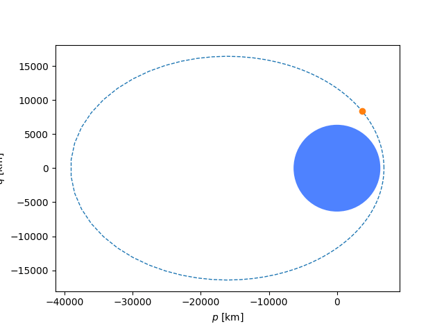

# Mr. Radar

<div align="center">
[](https://shields.io/)
[](https://shields.io/)
[](https://shields.io/)
</div>

## Prompt

> Given the radar pulse returns of a satellite, determine its orbital parameters (assume two-body dynamics). Each pulse has been provided as:
> * t, timestamp (UTC)
> * az, azimuth (degrees) +/- 0.001 deg
> * el, elevation (degrees) +/- 0.001 deg
> * r, range (km) +/- 0.1 km
> The radar is located at Kwajalein, 8.7256 deg latitude, 167.715 deg longitude, 35m altitude.  
>
> Estimate the satellite's orbit by providing the following parameters:
> * a, semi-major axis (km)
> * e, eccentricity (dimensionless)
> * i, inclination (degrees)
> * Ω, RAAN (degrees)
> * ω, argument of perigee (degrees)
> * υ, true anomaly (degrees)
> at the time of the final radar pulse, 2021-06-27-00:09:52.000-UTC

### Ticket

> Present this ticket when connecting to the challenge:  
> `ticket{hotel708324victor2:...}`  
> Don't share your ticket with other teams. 

### Connecting

> Connect to the challenge on:  
> `moon-virus.satellitesabove.me:5021`  
> 
> Using netcat, you might run:  
> `nc moon-virus.satellitesabove.me 5021`

### Files

> You'll need these files to solve the challenge. 
> * [https://static.2021.hackasat.com/zwv7nd5sj9vj9wk88o8aul48eun9](https://static.2021.hackasat.com/zwv7nd5sj9vj9wk88o8aul48eun9)

## Solution

The provided [`radar_data.txt`](/radar_data.txt) file has 100 of the pulses mentioned in the prompt, each one second apart.  

Connecting to the server and providing the ticket provides no new information that wasn't provided in the prompt, but it does have a lovely ASCII banner:

```
splash screen here
```

<div align="center">


</div>

We did it! The challenge is complete and the journalist has been saved. 

---

## Resources

* [OrbitalPy](https://github.com/RazerM/orbital)
