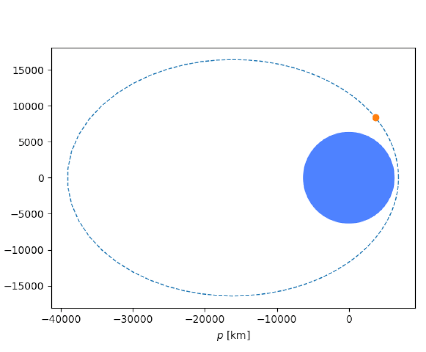

# Mr. Radar

<div align="center">


</div>

## Prompt

> Given the radar pulse returns of a satellite, determine its orbital parameters (assume two-body dynamics). Each pulse has been provided as:
> * t, timestamp (UTC)
> * az, azimuth (degrees) +/- 0.001 deg
> * el, elevation (degrees) +/- 0.001 deg
> * r, range (km) +/- 0.1 km
> The radar is located at Kwajalein, 8.7256 deg latitude, 167.715 deg longitude, 35m altitude.  
>
> Estimate the satellite's orbit by providing the following parameters:
> * a, semi-major axis (km)
> * e, eccentricity (dimensionless)
> * i, inclination (degrees)
> * Ω, RAAN (degrees)
> * ω, argument of perigee (degrees)
> * υ, true anomaly (degrees)
> at the time of the final radar pulse, 2021-06-27-00:09:52.000-UTC
> 
> ### Ticket
> 
> Present this ticket when connecting to the challenge:  
> `ticket{hotel708324victor2:...}`  
> Don't share your ticket with other teams. 
> 
> ### Connecting
> 
> Connect to the challenge on:  
> `moon-virus.satellitesabove.me:5021`  
> 
> Using netcat, you might run:  
> `nc moon-virus.satellitesabove.me 5021`
> 
> ### Files
> 
> You'll need these files to solve the challenge. 
> * [https://static.2021.hackasat.com/zwv7nd5sj9vj9wk88o8aul48eun9](https://static.2021.hackasat.com/zwv7nd5sj9vj9wk88o8aul48eun9)

## Solution

The provided [`radar_data.txt`](./radar_data.txt) file has 100 of the pulses mentioned in the prompt, each one second apart.  

```
time az(deg) el(deg) range(km)
2021-06-27-00:08:12.000-UTC	232.1248732	4.608410995	5561.036162
2021-06-27-00:08:13.000-UTC	232.1207825	4.687512746	5558.256788
2021-06-27-00:08:14.000-UTC	232.1161302	4.765942656	5555.508003
2021-06-27-00:08:15.000-UTC	232.1132568	4.843875409	5552.630467
...
```

Connecting to the server and providing the ticket gives us no new information, but it does have a lovely banner:

```
                             RADAR
                           CHALLENGE


                      +o+
                   o    .
               o         .
            o             .
          o                .r
        o                   .
      o                      .
    o                         .
   o                           . az,el
  o                  ...........A......
 o      .................          ............
   .......                                    ...........
.....                                                    .....


Welcome to the Radar Challenge!
Given the radar pulse returns of a satellite, determine its orbital parameters (assume two-body dynamics).
Each pulse has been provided as:
   t,  timestamp (UTC)
   az, azimuth (degrees) +/- 0.001 deg
   el, elevation (degrees) +/- 0.001 deg
   r,  range (km) +/- 0.1 km
The radar is located at Kwajalein, 8.7256 deg latitude, 167.715 deg longitude, 35m altitude.

Estimate the satellite's orbit by providing the following parameters:
   a,  semi-major axis (km)
   e,  eccentricity (dimensionless)
   i,  inclination (degrees)
   Ω,  RAAN (degrees)
   ω,  argument of perigee (degrees)
   υ,  true anomaly (degrees)

What is the satellite's orbit at 2021-06-27 00:09:52 UTC?
   a (km):
```

The first challenge in this category was to derive the orbital elements from the position and velocity of a spacecraft at a given time. There are many off-the-shelf tools that can be used to solve this problem, one of which is the [OrbitalPy](https://github.com/RazerM/orbital) package:

```
>>> orbit = orbital.KeplerianElements.from_state_vector(position, velocity, orbital.earth, ref_epoch)
>>> print(orbit)
KeplerianElements:
    Semimajor axis (a)                           =  24732.886 km
    Eccentricity (e)                             =      0.706807
    Inclination (i)                              =      0.1 deg
    Right ascension of the ascending node (raan) =     90.2 deg
    Argument of perigee (arg_pe)                 =    226.6 deg
    Mean anomaly at reference epoch (M0)         =     16.5 deg
    Period (T)                                   = 10:45:09.999830
    Reference epoch (ref_epoch)                  = 2021-06-26 19:20:00
        Mean anomaly (M)                         =     16.5 deg
        Time (t)                                 = 0:00:00
        Epoch (epoch)                            = 2021-06-26 19:20:00
```

Before we can apply the same tool to estimate the orbital elements in this problem, we need a few things:

* The position of the satellite at the last radar pulse in the J2000 Earth-centered intertial (ECI) coordinate frame
* The velocity of the satellite at the last radar pulse in km/s
* The reference epoch provided to us in the prompt: `2021-06-27 00:09:52 UTC`

### Position

We have the azimuth, elevation, and range (AER) of the satellite from the perspective of an observer in Kwajalein. Knowing the location of the observer, we can convert between AER and ECI coordinates. 

The [Pymap3d](https://github.com/geospace-code/pymap3d) package provides several coordinate conversions, including `aer2eci()`:

```
x, y, z = pymap3d.aer2eci(azimuth, elevation, range * 1000, latitude, longitude, altitude, time, deg=True)
```

Feeding the last line of [`radar_data.txt`] into this converter gives us the correct position in the proper coordinate system for [OrbitalPy](https://github.com/RazerM/orbital). 

### Velocity

<div align="center">


</div>

## Resources

* [OrbitalPy](https://github.com/RazerM/orbital)
* [Earth-centered inertial (ECI)](https://en.wikipedia.org/wiki/Earth-centered_inertial)
* [Pymap3d](https://github.com/geospace-code/pymap3d)
